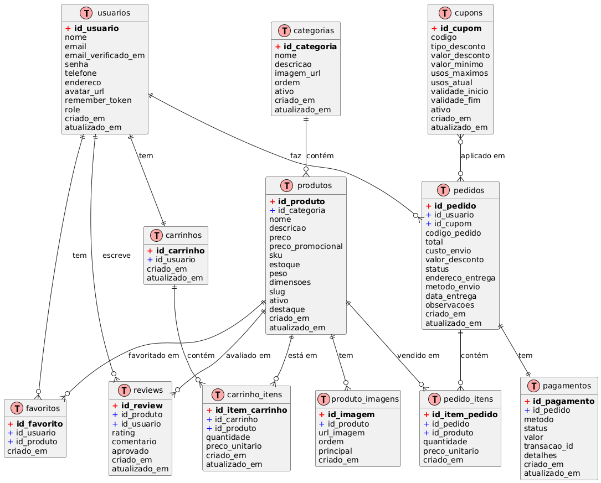

# **Modelo de Dados - B2CStore**

## **Tabelas Principais Revisadas**

### 1. **Tabela: `usuarios`**

| Campo                 | Tipo                    | Obrigatório | Descrição                       |
| --------------------- | ----------------------- | ----------- | ------------------------------- |
| `id_usuario`          | BIGINT                  | Sim         | Identificador único do usuário. |
| `nome`                | VARCHAR(150)            | Sim         | Nome completo do usuário.       |
| `email`               | VARCHAR(150)            | Sim         | E-mail único para autenticação. |
| `email_verificado_em` | TIMESTAMP               | Não         | Quando o e-mail foi verificado. |
| `senha`               | VARCHAR(255)            | Sim         | Senha criptografada.            |
| `telefone`            | VARCHAR(20)             | Não         | Número de telefone.             |
| `endereco`            | TEXT                    | Não         | Endereço completo.              |
| `avatar_url`          | VARCHAR(255)            | Não         | URL do avatar do usuário.       |
| `remember_token`      | VARCHAR(100)            | Não         | Token para "Lembrar de mim".    |
| `role`                | ENUM('cliente','admin') | Sim         | Tipo de usuário.                |
| `criado_em`           | TIMESTAMP               | Sim         | Data de criação.                |
| `atualizado_em`       | TIMESTAMP               | Sim         | Última atualização.             |

---

### 2. **Tabela: `categorias`**

| Campo           | Tipo         | Obrigatório | Descrição                         |
| --------------- | ------------ | ----------- | --------------------------------- |
| `id_categoria`  | BIGINT       | Sim         | Identificador único da categoria. |
| `nome`          | VARCHAR(100) | Sim         | Nome da categoria.                |
| `descricao`     | TEXT         | Não         | Descrição detalhada da categoria. |
| `imagem_url`    | VARCHAR(255) | Não         | Imagem representativa da categoria. |
| `ordem`         | INT          | Não         | Ordem de exibição.                |
| `ativo`         | BOOLEAN      | Sim         | Se a categoria está ativa.        |
| `criado_em`     | TIMESTAMP    | Sim         | Data de criação.                  |
| `atualizado_em` | TIMESTAMP    | Sim         | Última atualização.               |

---

### 3. **Tabela: `produtos`**

| Campo           | Tipo          | Obrigatório | Descrição                       |
| --------------- | ------------- | ----------- | ------------------------------- |
| `id_produto`    | BIGINT        | Sim         | Identificador único do produto. |
| `id_categoria`  | BIGINT        | Sim         | Categoria do produto.           |
| `nome`          | VARCHAR(200)  | Sim         | Nome do produto.                |
| `descricao`     | TEXT          | Não         | Descrição detalhada.            |
| `preco`         | DECIMAL(10,2) | Sim         | Preço atual.                    |
| `preco_promocional` | DECIMAL(10,2) | Não      | Preço em promoção.              |
| `sku`           | VARCHAR(100)  | Sim         | Código único do produto.        |
| `estoque`       | INT           | Sim         | Quantidade disponível.          |
| `peso`          | DECIMAL(8,2)  | Não         | Peso em kg para frete.          |
| `dimensoes`     | VARCHAR(100)  | Não         | Dimensões (LxAxC).              |
| `slug`          | VARCHAR(255)  | Sim         | URL amigável.                   |
| `ativo`         | BOOLEAN       | Sim         | Se o produto está ativo.        |
| `destaque`      | BOOLEAN       | Sim         | Se aparece em destaque.         |
| `criado_em`     | TIMESTAMP     | Sim         | Data de criação.                |
| `atualizado_em` | TIMESTAMP     | Sim         | Última atualização.             |

---

### 4. **Tabela: `produto_imagens`** ⭐ NOVA

| Campo           | Tipo         | Obrigatório | Descrição                       |
| --------------- | ------------ | ----------- | ------------------------------- |
| `id_imagem`     | BIGINT       | Sim         | Identificador único da imagem.  |
| `id_produto`    | BIGINT       | Sim         | Produto da imagem.              |
| `url_imagem`    | VARCHAR(255) | Sim         | URL da imagem.                  |
| `ordem`         | INT          | Sim         | Ordem de exibição.              |
| `principal`     | BOOLEAN      | Sim         | Se é a imagem principal.        |
| `criado_em`     | TIMESTAMP    | Sim         | Data de criação.                |

---

### 5. **Tabela: `carrinhos`**

| Campo           | Tipo      | Obrigatório | Descrição                  |
| --------------- | --------- | ----------- | -------------------------- |
| `id_carrinho`   | BIGINT    | Sim         | Identificador do carrinho. |
| `id_usuario`    | BIGINT    | Sim         | Dono do carrinho.          |
| `criado_em`     | TIMESTAMP | Sim         | Criação.                   |
| `atualizado_em` | TIMESTAMP | Sim         | Última atualização.        |

---

### 6. **Tabela: `carrinho_itens`**

| Campo              | Tipo          | Obrigatório | Descrição                |
| ------------------ | ------------- | ----------- | ------------------------ |
| `id_item_carrinho` | BIGINT        | Sim         | Identificador único.     |
| `id_carrinho`      | BIGINT        | Sim         | Carrinho relacionado.    |
| `id_produto`       | BIGINT        | Sim         | Produto adicionado.      |
| `quantidade`       | INT           | Sim         | Quantidade do item.      |
| `preco_unitario`   | DECIMAL(10,2) | Sim         | Preço na data da adição. |
| `criado_em`        | TIMESTAMP     | Sim         | Data de criação.         |
| `atualizado_em`    | TIMESTAMP     | Sim         | Atualização.             |

---

### 7. **Tabela: `pedidos`**

| Campo              | Tipo                                                  | Obrigatório | Descrição                  |
| ------------------ | ----------------------------------------------------- | ----------- | -------------------------- |
| `id_pedido`        | BIGINT                                                | Sim         | Identificador do pedido.   |
| `id_usuario`       | BIGINT                                                | Sim         | Usuário que fez o pedido.  |
| `codigo_pedido`    | VARCHAR(20)                                           | Sim         | Código único (ex: #B2C-0001) |
| `total`            | DECIMAL(10,2)                                         | Sim         | Total da compra.           |
| `custo_envio`      | DECIMAL(8,2)                                          | Sim         | Custo do frete.            |
| `valor_desconto`   | DECIMAL(10,2)                                         | Sim         | Valor do desconto aplicado.|
| `id_cupom`         | BIGINT                                                | Não         | Cupom aplicado.            |
| `status`           | ENUM('pendente','pago','processando','enviado','entregue','cancelado') | Sim | Estado do pedido. |
| `endereco_entrega` | TEXT                                                  | Sim         | Endereço final de entrega. |
| `metodo_envio`     | VARCHAR(50)                                           | Não         | Método de envio.           |
| `data_entrega`     | TIMESTAMP                                             | Não         | Data prevista de entrega.  |
| `observacoes`      | TEXT                                                  | Não         | Observações do pedido.     |
| `criado_em`        | TIMESTAMP                                             | Sim         | Criação.                   |
| `atualizado_em`    | TIMESTAMP                                             | Sim         | Atualização.               |

---

### 8. **Tabela: `pedido_itens`**

| Campo            | Tipo          | Obrigatório | Descrição                    |
| ---------------- | ------------- | ----------- | ---------------------------- |
| `id_item_pedido` | BIGINT        | Sim         | Identificador.               |
| `id_pedido`      | BIGINT        | Sim         | Pedido vinculado.            |
| `id_produto`     | BIGINT        | Sim         | Produto comprado.            |
| `quantidade`     | INT           | Sim         | Quantidade adquirida.        |
| `preco_unitario` | DECIMAL(10,2) | Sim         | Preço do produto no momento. |
| `criado_em`      | TIMESTAMP     | Sim         | Criação.                     |

---

### 9. **Tabela: `pagamentos`**

| Campo          | Tipo                                    | Obrigatório | Descrição                 |
| -------------- | --------------------------------------- | ----------- | ------------------------- |
| `id_pagamento` | BIGINT                                  | Sim         | Identificador.            |
| `id_pedido`    | BIGINT                                  | Sim         | Pedido pago.              |
| `metodo`       | ENUM('cartao','pix','boleto','transferencia') | Sim | Método de pagamento. |
| `status`       | ENUM('pendente','pago','falhou','reembolsado') | Sim | Situação do pagamento. |
| `valor`        | DECIMAL(10,2)                           | Sim         | Valor pago.               |
| `transacao_id` | VARCHAR(255)                            | Não         | ID externo de referência. |
| `detalhes`     | JSON                                    | Não         | Detalhes da transação.    |
| `criado_em`    | TIMESTAMP                               | Sim         | Criação.                  |
| `atualizado_em`| TIMESTAMP                               | Sim         | Atualização.              |

---

### 10. **Tabela: `cupons`** ⭐ NOVA

| Campo             | Tipo                    | Obrigatório | Descrição                       |
| ----------------- | ----------------------- | ----------- | ------------------------------- |
| `id_cupom`        | BIGINT                  | Sim         | Identificador único.            |
| `codigo`          | VARCHAR(50)             | Sim         | Código do cupom (ex: "VERAO10").|
| `tipo_desconto`   | ENUM('percentual','fixo') | Sim      | Tipo de desconto.               |
| `valor_desconto`  | DECIMAL(10,2)           | Sim         | Valor do desconto.              |
| `valor_minimo`    | DECIMAL(10,2)           | Não         | Valor mínimo da compra.         |
| `usos_maximos`    | INT                     | Não         | Limite de usos.                 |
| `usos_atual`      | INT                     | Sim         | Quantidade de usos atuais.      |
| `validade_inicio` | TIMESTAMP               | Não         | Início da validade.             |
| `validade_fim`    | TIMESTAMP               | Não         | Fim da validade.                |
| `ativo`           | BOOLEAN                 | Sim         | Se o cupom está ativo.          |
| `criado_em`       | TIMESTAMP               | Sim         | Data de criação.                |
| `atualizado_em`   | TIMESTAMP               | Sim         | Última atualização.             |

---

### 11. **Tabela: `reviews`**

| Campo        | Tipo      | Obrigatório | Descrição             |
| ------------ | --------- | ----------- | --------------------- |
| `id_review`  | BIGINT    | Sim         | Identificador.        |
| `id_produto` | BIGINT    | Sim         | Produto avaliado.     |
| `id_usuario` | BIGINT    | Sim         | Usuário que avaliou.  |
| `rating`     | INT       | Sim         | Nota de 1 a 5.        |
| `comentario` | TEXT      | Não         | Comentário adicional. |
| `aprovado`   | BOOLEAN   | Sim         | Se o review foi aprovado. |
| `criado_em`  | TIMESTAMP | Sim         | Criação.              |
| `atualizado_em` | TIMESTAMP | Sim      | Atualização.          |

---

### 12. **Tabela: `favoritos`**

| Campo         | Tipo      | Obrigatório | Descrição           |
| ------------- | --------- | ----------- | ------------------- |
| `id_favorito` | BIGINT    | Sim         | Identificador.      |
| `id_usuario`  | BIGINT    | Sim         | Usuário.            |
| `id_produto`  | BIGINT    | Sim         | Produto favoritado. |
| `criado_em`   | TIMESTAMP | Sim         | Data de criação.    |

---

## 🔗 **Resumo dos Relacionamentos**

```
usuarios (1)------(1) carrinhos
usuarios (1)------(N) pedidos
usuarios (1)------(N) reviews
usuarios (1)------(N) favoritos

categorias (1)----(N) produtos
produtos (1)------(N) produto_imagens ⭐ NOVO

produtos (1)------(N) carrinho_itens
produtos (1)------(N) pedido_itens
produtos (1)------(N) reviews
produtos (1)------(N) favoritos

carrinhos (1)-----(N) carrinho_itens

pedidos (1)-------(N) pedido_itens
pedidos (1)-------(1) pagamentos
pedidos (N)-------(1) cupons ⭐ NOVO

cupons (1)--------(N) pedidos ⭐ NOVO
```

# * **DER - Diagrama Entidade Relacionamento**

