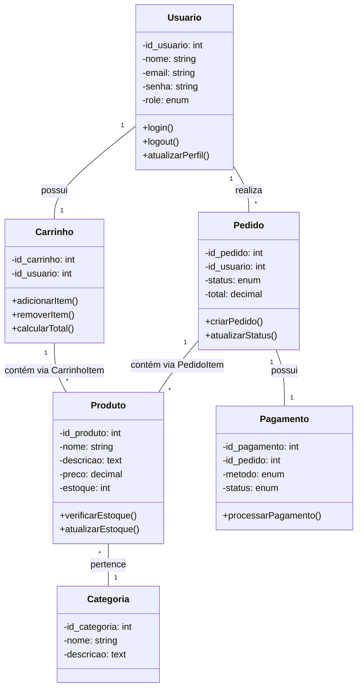

4. ENGENHARIA DE SOFTWARE (Continuação)

4.11. Engenharia de Requisitos

4.11.1. Requisitos Funcionais

ID Requisito Descrição Prioridade
RF-001 Cadastro de Usuário Usuário deve poder criar conta com nome, email, senha Alta
RF-002 Autenticação Usuário deve fazer login com email/senha Alta
RF-003 Recuperação de Senha Usuário deve poder resetar senha via email Média
RF-004 Navegação por Categorias Usuário deve ver produtos por categoria Alta
RF-005 Busca de Produtos Usuário deve buscar produtos por nome/descrição Alta
RF-006 Filtragem de Produtos Usuário deve filtrar por preço, categoria, avaliação Alta
RF-007 Detalhes do Produto Usuário deve ver detalhes completos do produto Alta
RF-008 Adicionar ao Carrinho Usuário deve adicionar produtos ao carrinho Alta
RF-009 Visualizar Carrinho Usuário deve ver itens no carrinho com quantidades Alta
RF-010 Atualizar Carrinho Usuário deve alterar quantidade ou remover itens Alta
RF-011 Calcular Total Sistema deve calcular subtotal, frete e total Alta
RF-012 Checkout Usuário deve finalizar compra com endereço e pagamento Alta
RF-013 Histórico de Pedidos Usuário logado deve ver pedidos anteriores Alta
RF-014 Avaliar Produto Usuário que comprou deve poder avaliar produto Média
RF-015 Favoritar Produto Usuário deve poder salvar produtos nos favoritos Média
RF-016 CRUD de Produtos (Admin) Administrador deve gerenciar produtos Alta
RF-017 CRUD de Categorias (Admin) Administrador deve gerenciar categorias Alta
RF-018 Gerenciar Pedidos (Admin) Administrador deve ver e atualizar status de pedidos Alta
RF-019 Gerenciar Usuários (Admin) Administrador deve gerenciar contas de usuários Média
RF-020 Dashboard Admin Administrador deve ver estatísticas da loja Média
RF-021 Dark/Light Mode Usuário deve alternar entre temas claro/escuro Baixa
RF-022 Upload de Imagens Administrador deve fazer upload de imagens de produtos Alta

4.11.2. Requisitos Não-Funcionais

ID Categoria Requisito Critério de Aceitação
RNF-001 Desempenho Tempo de resposta página inicial ≤ 2 segundos (95% das requisições)
RNF-002 Desempenho Tempo de resposta busca/filtro ≤ 1 segundo
RNF-003 Escalabilidade Suporte a 100 usuários simultâneos Sem degradação de performance
RNF-004 Disponibilidade Uptime do sistema ≥ 99.5% mensal
RNF-005 Segurança Proteção contra SQL Injection Zero vulnerabilidades conhecidas
RNF-006 Segurança Proteção contra XSS Input sanitizado em todas as entradas
RNF-007 Segurança Senhas armazenadas com hash Uso de bcrypt ou equivalente
RNF-008 Usabilidade Interface responsiva Funciona em dispositivos ≥ 320px
RNF-009 Usabilidade Tempo de aprendizado Usuário deve conseguir comprar em ≤ 5 minutos
RNF-010 Compatibilidade Navegadores suportados Chrome ≥ 90, Firefox ≥ 88, Safari ≥ 14
RNF-011 Manutenibilidade Cobertura de testes ≥ 70% código backend
RNF-012 Portabilidade Sistema operacional servidor Linux Ubuntu 20.04+
RNF-013 Backup Backup automático diário Backup completo banco + imagens
RNF-014 Acessibilidade Conformidade WCAG 2.1 AA Nível básico (contraste, navegação teclado)
RNF-015 Internacionalização Suporte a caracteres especiais UTF-8 em todo o sistema

4.12. Diagramas UML

4.12.1. Diagrama de Casos de Uso

```
┌─────────────────────────────────────────────────────────────┐
│                   Diagrama de Casos de Uso                   │
│                    Sistema B2CStore                          │
└─────────────────────────────────────────────────────────────┘

┌─────────────────┐      ┌──────────────────────────────────┐
│   Visitante     │      │        Usuário (Cliente)         │
├─────────────────┤      ├──────────────────────────────────┤
│ ◉ Navegar       │      │ ◉ Todas ações do Visitante       │
│ ◉ Buscar Produto│      │ ◉ Cadastrar-se                   │
│ ◉ Ver Produto   │      │ ◉ Fazer Login/Logout             │
│ ◉ Ver Carrinho  │      │ ◉ Gerenciar Perfil               │
└─────────┬───────┘      │ ◉ Finalizar Compra               │
          │              │ ◉ Ver Histórico de Pedidos        │
          │              │ ◉ Avaliar Produtos                │
          │              │ ◉ Favoritar Produtos              │
          │              └─────────────────┬─────────────────┘
          │                                │
          │              ┌─────────────────▼─────────────────┐
          │              │      Administrador (Admin)        │
          │              ├──────────────────────────────────┤
          │              │ ◉ Todas ações do Usuário         │
          │              │ ◉ Gerenciar Produtos (CRUD)      │
          │              │ ◉ Gerenciar Categorias (CRUD)    │
          └──────────────│ ◉ Gerenciar Pedidos              │
                         │ ◉ Gerenciar Usuários             │
                         │ ◉ Visualizar Dashboard           │
                         │ ◉ Gerenciar Estoque              │
                         └──────────────────────────────────┘

                        ┌─────────────────────┐
                        │    Sistema Externo  │
                        ├─────────────────────┤
                        │ ◉ Gateway Pagamento │
                        │ ◉ Serviço de Email  │
                        │ ◉ API Transportadora│
                        └─────────────────────┘
```

4.12.2. Casos de Uso Detalhados

Caso de Uso: UC-001 - Realizar Compra

Elemento Descrição
Nome Realizar Compra
Ator Principal Usuário (Cliente)
Pré-condições Usuário autenticado, produto disponível em estoque
Fluxo Principal 1. Usuário navega para produto 2. Adiciona ao carrinho 3. Acessa carrinho 4. Vai para checkout 5. Preenche endereço 6. Seleciona pagamento 7. Confirma pedido
Fluxos Alternativos 2a. Produto sem estoque: exibe mensagem de erro 5a. Usa endereço salvo: seleciona de lista 6a. Pagamento falha: retorna ao passo 6
Pós-condições Pedido criado, estoque atualizado, email de confirmação enviado

Caso de Uso: UC-002 - Gerenciar Produto (Admin)

Elemento Descrição
Nome Gerenciar Produto
Ator Principal Administrador
Pré-condições Administrador autenticado
Fluxo Principal 1. Acessa painel admin 2. Navega para produtos 3. Clica "Adicionar Produto" 4. Preenche formulário 5. Faz upload de imagens 6. Salva produto
Fluxos Alternativos 4a. Edita produto existente: seleciona produto e altera dados 4b. Remove produto: confirma exclusão
Pós-condições Produto adicionado/editado/removido do catálogo

4.12.3. Diagrama de Sequência - Processo de Compra

```
┌─────────┐    ┌──────────┐    ┌──────────┐    ┌──────────┐    ┌──────────┐
│ Cliente │    │  Frontend │    │ Backend  │    │ Database │    │ Serviços │
└────┬────┘    └─────┬─────┘    └────┬─────┘    └────┬─────┘    └────┬─────┘
     │                │                │               │                │
     │1. Adiciona ao  │                │               │                │
     │──────Carrinho──>                │               │                │
     │                │                │               │                │
     │                │2. Valida Estoque│               │                │
     │                │───────────────>│               │                │
     │                │                │3. Query Estoque│               │
     │                │                │──────────────>│               │
     │                │                │               │4. Retorna Qtd  │
     │                │                │<───────────────│               │
     │                │5. Estoque OK   │               │                │
     │                │<───────────────│               │                │
     │                │                │               │                │
     │                │6. Adiciona Item│               │                │
     │                │───────────────>│               │                │
     │                │                │7. Insere Cart Item│           │
     │                │                │──────────────>│               │
     │                │                │               │8. Confirma    │
     │                │                │<───────────────│               │
     │                │9. Feedback OK  │               │                │
     │<───────────────│                │               │                │
     │                │                │               │                │
     │10. Checkout    │                │               │                │
     │───────────────>│                │               │                │
     │                │11. Cria Pedido │               │                │
     │                │───────────────>│               │                │
     │                │                │12. Transaction│               │
     │                │                │──────────────>│               │
     │                │                │               │13. Atualiza BD │
     │                │                │<───────────────│               │
     │                │14. Email Confirmação│         │                │
     │                │───────────────────────────────────────>│
     │15. Confirmação │                │               │                │
     │<───────────────│                │               │                │
```

4.12.4. Diagrama de Atividades - Fluxo de Checkout

```
┌─────────────────────────────────────────────────────────────┐
│                   Fluxo de Checkout                          │
├─────────────────────────────────────────────────────────────┤
│                                                             │
│  ┌─────────────┐                                            │
│  │  Início     │                                            │
│  │ Checkout    │                                            │
│  └──────┬──────┘                                            │
│         │                                                   │
│  ┌──────▼──────┐      Não ┌──────────────────┐             │
│  │Usuário      ├──────────►│ Redireciona para │             │
│  │Autenticado? │           │    Login         │             │
│  └──────┬──────┘           └──────────────────┘             │
│         │ Sim                                               │
│  ┌──────▼──────┐                                            │
│  │Valida       │      Não ┌──────────────────┐             │
│  │Carrinho     ├──────────►│Mensagem: Carrinho│             │
│  └──────┬──────┘           │     Vazio        │             │
│         │ Sim              └──────────────────┘             │
│  ┌──────▼──────┐                                            │
│  │Formulário   │                                            │
│  │Endereço     │                                            │
│  └──────┬──────┘                                            │
│         │                                                   │
│  ┌──────▼──────┐                                            │
│  │Seleciona    │                                            │
│  │Pagamento    │                                            │
│  └──────┬──────┘                                            │
│         │                                                   │
│  ┌──────▼──────┐      Não ┌──────────────────┐             │
│  │Valida       ├──────────►│Exibe Erros e     │             │
│  │Dados        │           │Solicita Correção │             │
│  └──────┬──────┘           └──────────────────┘             │
│         │ Sim                                               │
│  ┌──────▼──────┐                                            │
│  │Cria Pedido  │                                            │
│  │e Atualiza   │                                            │
│  │Estoque      │                                            │
│  └──────┬──────┘                                            │
│         │                                                   │
│  ┌──────▼──────┐                                            │
│  │Envia Email  │                                            │
│  │Confirmação  │                                            │
│  └──────┬──────┘                                            │
│         │                                                   │
│  ┌──────▼──────┐                                            │
│  │Exibe        │                                            │
│  │Confirmação  │                                            │
│  │e Número do  │                                            │
│  │Pedido       │                                            │
│  └─────────────┘                                            │
│                                                             │
└─────────────────────────────────────────────────────────────┘
```

4.12.5. Diagrama de Classes Simplificado



4.13. Especificação de Interfaces

4.13.1. API REST Endpoints (Backend)

Endpoint Método Descrição Parâmetros Resposta
/api/auth/register POST Registrar novo usuário {name, email, password} {user, token}
/api/auth/login POST Autenticar usuário {email, password} {user, token}
/api/products GET Listar produtos ?category=, ?min_price=, ?max_price= [{product}]
/api/products/{id} GET Detalhes do produto - {product, images}
/api/cart GET Obter carrinho - {items, total}
/api/cart/items POST Adicionar item {product_id, quantity} {cart}
/api/cart/items/{id} PUT Atualizar item {quantity} {cart}
/api/orders POST Criar pedido {address, payment_method} {order}
/api/admin/products POST Criar produto (admin) FormData (multipart) {product}

4.13.2. Interface de Usuário (Wireframes Principais)

Página Inicial:

```
┌─────────────────────────────────────────────────────────────┐
│ [Logo]              [Busca] [Carrinho(3)] [Login] [🌓]      │
├─────────────────────────────────────────────────────────────┤
│ ┌─────────────────────────────────────────────────────────┐ │
│ │                    BANNER PROMOCIONAL                   │ │
│ │                 "Grande Liquidação de Verão"            │ │
│ └─────────────────────────────────────────────────────────┘ │
│                                                             │
│ ┌─────────┐ ┌─────────┐ ┌─────────┐ ┌─────────┐            │
│ │ Eletrôn.│ │  Moda   │ │ Casa    │ │ Esporte │            │
│ │   📱    │ │   👕    │ │   🏠    │ │   ⚽    │            │
│ └─────────┘ └─────────┘ └─────────┘ └─────────┘            │
│                                                             │
│ ┌─────────────────────────────────────────────────────────┐ │
│ │               PRODUTOS EM DESTAQUE                      │ │
│ │ ┌─────┐ ┌─────┐ ┌─────┐ ┌─────┐                        │ │
│ │ │     │ │     │ │     │ │     │                        │ │
│ │ │Prod1│ │Prod2│ │Prod3│ │Prod4│                        │ │
│ │ │R$99 │ │R$149│ │R$79 │ │R$199│                        │ │
│ │ └─────┘ └─────┘ └─────┘ └─────┘                        │ │
│ └─────────────────────────────────────────────────────────┘ │
└─────────────────────────────────────────────────────────────┘
```

Página de Produto:

```
┌─────────────────────────────────────────────────────────────┐
│ [Logo] [‹ Voltar]        [Busca] [Carrinho] [Perfil] [🌓]   │
├─────────────────────────────────────────────────────────────┤
│                                                             │
│ ┌──────────────┐ ┌──────────────────────────────────────┐  │
│ │              │ │ NOME DO PRODUTO                      │  │
│ │    IMAGEM    │ │ ⭐⭐⭐⭐⭐ (124 avaliações)            │  │
│ │   PRINCIPAL  │ │                                      │  │
│ │              │ │ R$ 299,99                            │  │
│ │ [Miniaturas] │ │ ou 10x de R$ 29,99                   │  │
│ └──────────────┘ │                                      │  │
│                  │ Estoque: 15 unidades                 │  │
│                  │                                      │  │
│                  │ [Opções: Tamanho ▾] [Cor: ▾]        │  │
│                  │                                      │  │
│                  │ [✅] Adicionar aos Favoritos         │  │
│                  │                                      │  │
│                  │ [🛒 ADICIONAR AO CARRINHO]           │  │
│                  │ [💰 COMPRAR AGORA]                   │  │
│                  └──────────────────────────────────────┘  │
│                                                             │
│ ┌────────────────────────────────────────────────────────┐ │
│ │ DESCRIÇÃO DO PRODUTO                                   │ │
│ │                                                        │ │
│ │ ┌────────────────────────────────────────────────────┐ │ │
│ │ │ Avaliações (4.5/5)                                │ │ │
│ │ │ "Ótimo produto, recomendo!" - Maria S.            │ │ │
│ │ └────────────────────────────────────────────────────┘ │ │
│ └────────────────────────────────────────────────────────┘ │
└─────────────────────────────────────────────────────────────┘
```

4.14. Especificação de Dados

4.14.1. Esquema de Banco de Dados Detalhado

```sql
-- Tabela de Usuários (exemplo detalhado)
CREATE TABLE usuarios (
    id_usuario BIGINT UNSIGNED AUTO_INCREMENT PRIMARY KEY,
    nome VARCHAR(150) NOT NULL,
    email VARCHAR(150) UNIQUE NOT NULL,
    email_verificado_em TIMESTAMP NULL,
    senha VARCHAR(255) NOT NULL,
    telefone VARCHAR(20),
    endereco TEXT,
    cidade VARCHAR(100),
    provincia VARCHAR(100),
    avatar_url VARCHAR(255),
    remember_token VARCHAR(100),
    role ENUM('cliente', 'admin', 'gerente', 'suporte') DEFAULT 'cliente',
    ativo BOOLEAN DEFAULT TRUE,
    criado_em TIMESTAMP DEFAULT CURRENT_TIMESTAMP,
    atualizado_em TIMESTAMP DEFAULT CURRENT_TIMESTAMP ON UPDATE CURRENT_TIMESTAMP,
    INDEX idx_email (email),
    INDEX idx_role (role)
);

-- Tabela de Sessões de Carrinho
CREATE TABLE carrinhos (
    id_carrinho BIGINT UNSIGNED AUTO_INCREMENT PRIMARY KEY,
    id_usuario BIGINT UNSIGNED,
    session_id VARCHAR(255) NULL, -- Para usuários não autenticados
    total DECIMAL(10,2) DEFAULT 0.00,
    criado_em TIMESTAMP DEFAULT CURRENT_TIMESTAMP,
    atualizado_em TIMESTAMP DEFAULT CURRENT_TIMESTAMP ON UPDATE CURRENT_TIMESTAMP,
    FOREIGN KEY (id_usuario) REFERENCES usuarios(id_usuario) ON DELETE CASCADE,
    INDEX idx_usuario (id_usuario),
    INDEX idx_session (session_id)
);
```

4.14.2. Regras de Negócio para Dados

Regra Descrição Implementação
RN-001 Preço não pode ser negativo CHECK (preco >= 0)
RN-002 Estoque não pode ser negativo CHECK (estoque >= 0)
RN-003 Email deve ser único UNIQUE CONSTRAINT
RN-004 Data de validade do cupom > data atual Trigger before insert/update
RN-005 Rating entre 1 e 5 CHECK (rating BETWEEN 1 AND 5)
RN-006 Ordem de imagem >= 1 CHECK (ordem >= 1)
RN-007 SKU único por produto UNIQUE CONSTRAINT

4.15. Matriz de Rastreabilidade de Requisitos

Requisito Caso de Uso Componente Frontend Componente Backend Teste
RF-001 UC-003 (Cadastro) RegisterForm.vue AuthController test_user_registration
RF-008 UC-001 (Compra) AddToCartButton CartService test_add_to_cart
RF-012 UC-001 (Compra) CheckoutPage OrderController test_checkout_process
RF-016 UC-002 (Admin) ProductManager ProductController test_crud_product
RNF-001 - - CacheMiddleware test_performance_home
RNF-008 Todos Tailwind (responsive) - test_responsive_design

4.16. Plano de Testes

4.16.1. Tipos de Testes

Tipo de Teste Escopo Ferramentas Cobertura Alvo
Testes Unitários Funções individuais, métodos PHPUnit, Pest 80% backend
Testes de Integração Interação entre componentes Laravel Dusk Fluxos principais
Testes de Sistema Sistema completo Selenium, Cypress 100% funcionalidades
Testes de Aceitação Requisitos de negócio Cucumber, Behat Casos de uso críticos
Testes de Performance Tempo resposta, carga JMeter, k6 RNF-001 a RNF-003
Testes de Segurança Vulnerabilidades OWASP ZAP, SonarQube RNF-005 a RNF-007

4.16.2. Casos de Teste Exemplares

CT-001: Adicionar produto ao carrinho

```php
public function test_add_product_to_cart()
{
    // Arrange
    $user = User::factory()->create();
    $product = Product::factory()->create(['estoque' => 10]);
    
    // Act
    $response = $this->actingAs($user)
        ->post('/api/cart/items', [
            'product_id' => $product->id,
            'quantity' => 2
        ]);
    
    // Assert
    $response->assertStatus(201);
    $this->assertDatabaseHas('carrinho_itens', [
        'id_produto' => $product->id,
        'quantidade' => 2
    ]);
    $this->assertEquals(8, $product->fresh()->estoque);
}
```

CT-002: Checkout com estoque insuficiente

```php
public function test_checkout_insufficient_stock()
{
    // Arrange
    $user = User::factory()->create();
    $product = Product::factory()->create(['estoque' => 1]);
    
    // Adiciona 2 unidades ao carrinho
    $this->actingAs($user)
        ->post('/api/cart/items', [
            'product_id' => $product->id,
            'quantity' => 2
        ]);
    
    // Act & Assert
    $response = $this->post('/api/orders', [
        'address' => 'Endereço teste',
        'payment_method' => 'simulado'
    ]);
    
    $response->assertStatus(422);
    $this->assertStringContainsString('estoque insuficiente', $response->content());
}
```

4.17. Critérios de Aceitação

4.17.1. Por Funcionalidade

Funcionalidade: Checkout

· Usuário autenticado pode finalizar compra
· Sistema valida estoque antes de criar pedido
· Pedido criado com status "pendente"
· Email de confirmação enviado ao cliente
· Estoque reduzido após compra confirmada
· Carrinho limpo após compra
· Número do pedido único gerado

Funcionalidade: Dashboard Admin

· Acesso restrito a usuários com role "admin"
· Exibe estatísticas de vendas (últimos 30 dias)
· Mostra pedidos recentes com status
· Gráfico de vendas por período
· Links rápidos para ações comuns

4.17.2. Métricas de Qualidade

· Cobertura de Código: ≥ 70% backend
· Bugs Críticos: 0 em produção
· Tempo de Carregamento: < 3s no 3G
· Acessibilidade: Score Lighthouse ≥ 90
· SEO: Meta tags em todas as páginas
· Cross-browser: Funciona em últimos 2 versões principais

---

Esta seção completa a parte de Engenharia de Software com:

1. Requisitos Funcionais e Não-Funcionais detalhados
2. Diagramas UML (Casos de Uso, Sequência, Atividades, Classes)
3. Especificação de Interfaces (API e Wireframes)
4. Especificação de Dados com regras de negócio
5. Matriz de Rastreabilidade
6. Plano de Testes com casos exemplares
7. Critérios de Aceitação por funcionalidade
